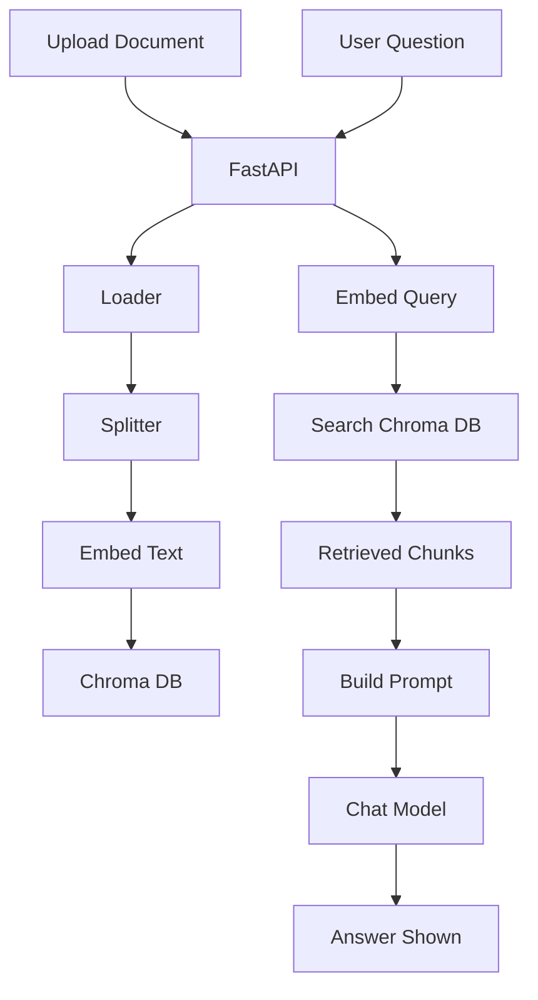

LangChain RAG Chatbot

A **Retrieval-Augmented Generation (RAG)** chatbot built using **LangChain**, **OpenAI**, **FastAPI**, **ChromaDB**, and **Streamlit**. This project enables users to upload documents (`PDF`, `DOCX`, `HTML`), ask natural language queries, and get context-aware answers grounded in the uploaded content. Chat sessions are logged and stored in an SQLite database for traceability.

---

##  Features

-  Upload and index documents with ChromaDB.
-  Chat with a conversational interface powered by OpenAI models (`gpt-4o`, `gpt-4o-mini`).
-  Context-aware retrieval using LangChain’s `history-aware retriever`.
-  Memory-enabled RAG: reformulates queries based on chat history.
-  Support for `.pdf`, `.docx`, `.html` files.
-  Document management (list/delete indexed files).
-  SQLite-based logging for chat history and document metadata.
-  Modern UI using Streamlit.

---

##  Tech Stack

| Layer            | Tech                                                                 |
|------------------|----------------------------------------------------------------------|
| Frontend         | Streamlit                                                            |
| Backend API      | FastAPI                                                              |
| LLM              | OpenAI (via LangChain)                                               |
| Vector DB        | Chroma                                                               |
| Embeddings       | `OpenAIEmbeddings` via LangChain                                     |
| File Loaders     | `PyPDFLoader`, `Docx2txtLoader`, `UnstructuredHTMLLoader`            |
| Prompt Engineering | `ChatPromptTemplate`, `StuffDocumentsChain`, `create_retrieval_chain` |
| Database         | SQLite (chat + file metadata logging)                                |

---

##   RAG Flow Diagram (Upload + Query)




---

## 📂 Folder Structure

```
.
├── api_utils.py
├── chroma_utils.py
├── db_utils.py
├── langchain_utils.py
├── main.py                  # FastAPI entry point
├── streamlit_app.py         # Streamlit frontend
├── chat_interface.py
├── sidebar.py
├── pydantic_models.py
├── rag_app.db               # SQLite database
├── chroma_db/               # Persisted vector store
└── README.md
```

---

##  Installation

### 1. Clone the Repository

```bash
git clone https://github.com/yourusername/langchain-rag-chatbot.git
cd langchain-rag-chatbot
```

### 2. Create a Virtual Environment

```bash
python -m venv venv
source venv/bin/activate  # On Windows: venv\Scripts\activate
```

### 3. Install Dependencies

```bash
pip install -r requirements.txt
```

> Make sure you have your OpenAI API key set in `.env` or environment variables.

### 4. Run the Backend (FastAPI)

```bash
uvicorn main:app --reload
```

### 5. Launch the Streamlit Frontend

```bash
streamlit run streamlit_app.py
```

---

##  Requirements

Add the following to your `requirements.txt`:

```text
streamlit
fastapi
uvicorn
requests
python-dotenv
langchain
langchain-openai
langchain-community
langchain-core
langchain-chroma
chromadb
pypdf
python-docx
unstructured
docx2txt
```

---

##  Environment Variables

Create a `.env` file in the root with the following:

```env
OPENAI_API_KEY=""
LANGCHAIN_TRACING_V2 = true
LANGCHAIN_API_KEY = ""
LANGCHAIN_PROJECT = "ragbot"
```

---

##  Example Use Cases

- Upload personal documents and get real-time answers.
- Provide FAQs and allow natural language interaction.
- Explore structured

